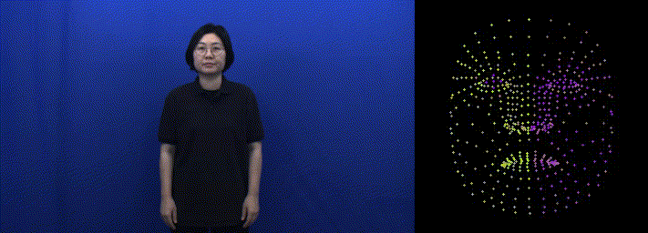

# 🚀 Signer Anonymization Project

이 프로젝트는 **수화 영상을 입력(Input)으로 받아** Mediapipe를 활용하여 다양한 출력을 생성하는 프로젝트입니다.  
Mediapipe의 여러 기능을 활용하여 **포즈, 손, 얼굴 등의 랜드마크 데이터를 추출**하고 이를 활용할 수 있도록 구성되었습니다.

---

## 📌 기능 개요

이 프로젝트는 **수화 영상의 다양한 요소를 분석 및 변환하여 출력하는 기능**을 제공합니다.  
[Mediapipe](https://github.com/google/mediapipe)의 강력한 기능을 활용하여 **신체, 손, 얼굴 등의 특징점(랜드마크) 데이터를 추출 및 활용**할 수 있습니다.

총 **5가지 주요 기능**이 있으며, 각각의 기능은 독립적으로 실행할 수 있습니다.

### 1️⃣ **Pose 분석 (`mediapipe_pose.py`)**

- **전신 및 상체의 주요 관절 포인트를 추출**하여 자세 분석을 수행합니다.
- Mediapipe의 Pose 모듈을 사용하여 **신체의 자세(Posture)를 분석**할 수 있습니다.
- 분석된 포인트를 기반으로 **영상 오버레이 형식의 데이터로 저장**합니다.
- **빠르고 효율적인 신체 자세 분석**을 지원합니다.
  

### 2️⃣ **Holistic 분석 (`mediapipe_holistic.py`)**

- Mediapipe의 **Holistic 모듈을 사용하여 포즈, 얼굴, 손의 랜드마크를 동시에 추출**합니다.
- **분할(Segmentation) 기능**을 활용하여 배경과 객체를 구분할 수 있습니다.
- 결과 데이터는 JSON 형식으로 저장되며, 영상 오버레이도 생성됩니다.
  

### 3️⃣ **CCBR 기반 영상 변환 (`mediapipe_ccbr.py`)**

- **CCBR (Context-Corrected Blur and Remove) 기법을 사용하여 얼굴을 포함한 랜드마크의 익명화 처리**를 수행합니다.
- **그룹별로 다른 색상으로 랜드마크를 시각화**하여 랜드마크 간의 관계를 명확히 합니다.
- 변환된 결과를 **동영상 및 개별 이미지 파일**로 저장합니다.
  

### 4️⃣ **CCBR 기반 얼굴 변환 (`mediapipe_ccbr_face.py`)**

- CCBR 기법을 얼굴 영역에만 적용하여 **얼굴 랜드마크의 정밀한 익명화**를 수행합니다.
- 얼굴 영역을 **확대하여 랜드마크를 시각화**하고, 그룹별 색상을 적용합니다.
- 출력된 결과는 **동영상 파일**로 저장됩니다.
  

### 5️⃣ **참조 데이터 추출 (`mediapipe_reference.py`)**

- **특정 프레임(예: 50)에서 포즈, 얼굴, 손의 랜드마크를 추출하여 JSON 파일 및 이미지(png) 파일로 저장**합니다.
- **참조 데이터를 수집**하여 **후처리 및 시각화 분석**에 유용합니다.
- 랜드마크 데이터는 **JSON 형식**으로 저장되며, **이미지 파일로 시각화**됩니다.

---

## 🔧 실행 환경 설정

이 프로젝트를 실행하기 위해서는 **Conda 환경**을 설정한 후 필요한 라이브러리를 설치해야 합니다.

### 1️⃣ **Conda 환경 생성 및 활성화**

```bash
conda create -n mediapipe_env python=3.9 -y
conda activate mediapipe_env
```

### 2️⃣ **필요 패키지 설치**

```bash
pip install -r requirements.txt
```

---

## ▶ 사용 방법

### 1️⃣ **영상 입력 및 처리**

1. `data/input/` 폴더에 **수화 영상(mp4)**을 추가합니다.
2. 실행하고 싶은 소스코드를 선택하여 실행합니다.

예제 실행 코드:

```bash
python source/mediapipe_pose.py --input data/input/sign_language.mp4 --output data/output/mediapipe_pose_test
python source/mediapipe_holistic.py --input data/input/sign_language.mp4 --output data/output/mediapipe_holistic_test
python source/mediapipe_ccbr.py --input data/input/sign_language.mp4 --output data/output/mediapipe_ccbr_test
python source/mediapipe_ccbr_face.py --input data/input/sign_language.mp4 --output data/output/mediapipe_ccbr_face_test
python source/mediapipe_reference.py --input data/input/sign_language.mp4 --output data/output/mediapipe_reference_test
```

### 2️⃣ **출력 데이터 구조**

처리된 결과는 `data/output/` 폴더에 저장됩니다.

#### **📂 데이터 출력 구조**

```
📁 data
│── 📁 input
│   ├── sign_language.mp4          # 원본 수화 영상
│── 📁 output
│   ├── 📁 01_mediapipe_pose
│   │   ├── sign_language_pose.mp4
│   ├── 📁 02_mediapipe_holistic
│   │   ├── sign_language_holistic.mp4
│   ├── 📁 03_mediapipe_ccbr
│   │   ├── sign_language_ccbr.mp4
│   ├── 📁 04_mediapipe_ccbr_face
│   │   ├── sign_language_ccbr_face.mp4
│   ├── 📁 05_reference
│   │   ├── _README.txt
│   │   ├── face_landmarks.json
│   │   ├── face_landmarks.png
│   │   ├── hand_landmarks.json
│   │   ├── hand_landmarks.png
│   │   ├── pose_landmarks.json
│   │   ├── pose_landmarks.png
│   │   ├── segmentation_mask.json
│   │   ├── segmentation_mask.png
```

---

## 📂 프로젝트 구조

```
📁 Sign Language Project
│── 📁 data
│── 📁 source                    # 주요 소스코드
│   ├── mediapipe_ccbr_face.py
│   ├── mediapipe_ccbr.py
│   ├── mediapipe_holistic.py
│   ├── mediapipe_pose.py
│   ├── mediapipe_reference.py
│── requirements.txt             # 필요한 패키지 목록
│── README.md                    # 프로젝트 설명 파일
```

---

## 📌 TODO

- [ ]

---

## 📜 라이선스
